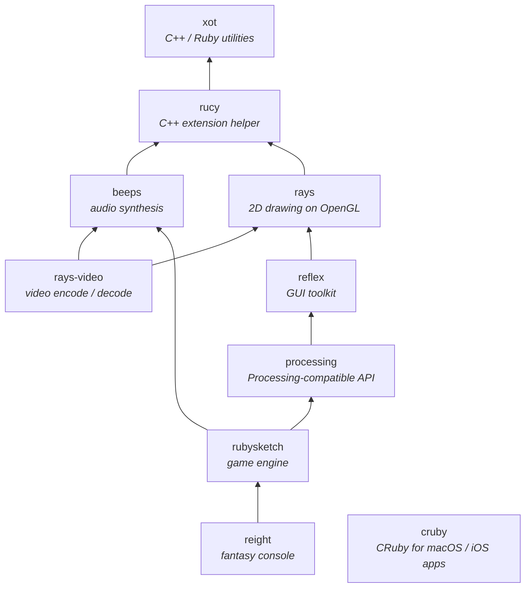

<h1 align="center">xord/all</h1>

<p align="center">
  <b>The monorepo behind the <code>xord/*</code> creative-coding stack for Ruby</b>
</p>

<p align="center">
  <a href="https://deepwiki.com/xord/all"></a>
  
  
</p>

<p align="center">
  <a href="#-libraries-in-this-monorepo">Libraries</a> •
  <a href="#-installation">Installation</a> •
  <a href="#%EF%B8%8F-how-to-develop">Development</a> •
  <a href="#-contributions">Contributing</a> •
  <a href="#-license">License</a>
</p>

---

**xord/all** is the monorepo where every `xord/*` library is developed. Each library lives at the repository root, shares a common build / test pipeline, and is mirrored out to its own standalone repository (and published as a Ruby gem or a CocoaPod) from here.

The libraries form a stack: low-level utilities at the bottom, a 2D drawing engine and a GUI toolkit on top, and creative-coding / game-engine layers on top of those.



## 📚 Libraries in this monorepo

| Module        | Distribution                | Role                                                                                              |
| ------------- | --------------------------- | ------------------------------------------------------------------------------------------------- |
| [`xot`](./xot)               | gem `xot`         | Shared C++ utilities and Ruby helpers used by everything below                                    |
| [`rucy`](./rucy)             | gem `rucy`        | C++ helper layer over Ruby's C API for writing native extensions                                  |
| [`beeps`](./beeps)           | gem `beeps`       | Audio synthesis and playback — oscillators, filters, envelopes, effects, sound files             |
| [`rays`](./rays)             | gem `rays`        | Hardware-accelerated 2D drawing engine on OpenGL                                                  |
| [`rays-video`](./rays-video) | gem `rays-video`  | Video encoding / decoding with audio support, built on Rays and Beeps                             |
| [`reflex`](./reflex)         | gem `reflexion`   | Cross-platform GUI toolkit — Window / View / Events on top of Rays                                |
| [`processing`](./processing) | gem `processing`  | Processing-compatible creative-coding framework for CRuby                                         |
| [`rubysketch`](./rubysketch) | gem `rubysketch`  | Processing-style game engine — adds Sprite, physics, Sound, MML, easings                          |
| [`reight`](./reight)         | gem `reight`      | Fantasy-console-style retro game engine with built-in sprite / map / sound editors                |
| [`cruby`](./cruby)           | CocoaPod `CRuby`  | Embeds the CRuby (MRI) interpreter into macOS / iOS apps                                          |

See each subdirectory's `README.md` for installation, requirements, and usage details.

## 🔄 Mirroring

This repository is the source of truth. Each library is mirrored out to its own standalone repository using `git subtree push`, and that's what the gem / pod build pipelines consume.

> [!IMPORTANT]
> Please open issues and pull requests against **this** repository, not against the per-library mirrors — the mirrors are read-only.

## 📦 Installation

For installation instructions, please refer to the `README.md` file in each subdirectory. If you are reaching for a specific gem (`processing`, `rubysketch`, `reight`, …), you don't need this monorepo — install the gem directly from RubyGems and its dependencies will be pulled in.

## 🛠️ How to develop

The Rakefile delegates to each module. Without a scope it operates on all gems; pass a module name (or `:all`, `:exts`, `:gems`) to narrow it down.

```bash
# Build everything
$ rake lib           # C/C++ libraries (libxot, librucy, libbeeps, librays, libreflex, ...)
$ rake ext           # Ruby native extensions
$ rake test          # run tests

# Scope to one or a few modules
$ rake rays ext
$ rake rays reflex test
$ rake xot rucy beeps lib

# Other useful tasks
$ rake vendor        # clone third-party libs into each module's vendor/
$ rake erb           # expand ERB-templated headers (rucy mostly)
$ rake gem           # build .gem files
$ rake clean
$ rake clobber
```

Scope selectors:

| Selector  | Targets                                                          |
| --------- | ---------------------------------------------------------------- |
| (default) | All gems (`xot`, `rucy`, `beeps`, `rays`, `rays-video`, `reflex`, `processing`, `rubysketch`, `reight`) |
| `:all`    | All repositories, including `cruby`                              |
| `:exts`   | Modules that build a native extension (`xot`, `rucy`, `beeps`, `rays`, `rays-video`, `reflex`) |
| `:gems`   | Same as default (every published Ruby gem)                       |
| `xot` / `rays` / … | A specific module                                       |

### Run samples / examples

Each gem keeps runnable samples or examples next to its source:

```bash
$ ruby reflex/samples/hello.rb
$ ruby reflex/samples/physics.rb
$ ruby processing/examples/shapes.rb
$ ruby rubysketch/examples/sprite.rb
```

### Update shared Git hooks and CI

`.hooks/` and `.workflows/` at the repository root generate the Git hook scripts and CI workflow files that get distributed into each module. Edit the source under `.hooks/` / `.workflows/`, then re-run the generator (see the local scripts) to fan changes out.

## 🤝 Contributions

Contributions are welcome! All development happens here in **xord/all** — please open issues and pull requests against this repository, not against the per-library mirrors.

For more details, please refer to [CONTRIBUTING.md](./CONTRIBUTING.md).

## 📜 License

**xord/all** is licensed under the MIT License.
See the [LICENSE](./LICENSE) file for details.

Each bundled / vendored upstream library (Box2D, RtMidi, STK, AudioFile, r8brain-free-src, signalsmith-stretch, GLM, Clipper, earcut.hpp, splines-lib, stb, OpenSSL, libyaml, Ruby) retains its own license; see each module's `vendor/` and `LICENSE` directories.
